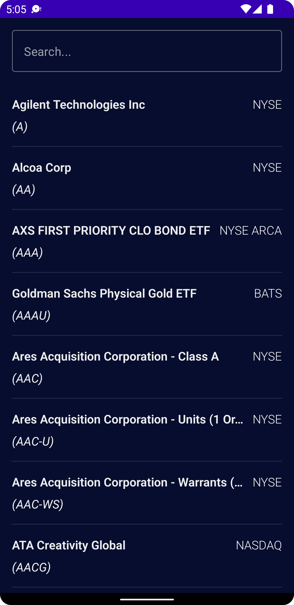
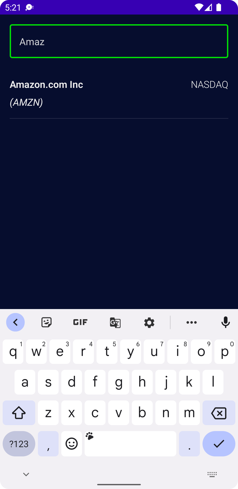

# Stock-Market-Application
<h3>
This is an Android Application which displays the list of stocks in the US market and its respective graph. 
User can search for a company in the list and see the details of that stock in the details screen.
</h3>

This app is built with all the relevant concepts needed to build a solid app with the clean architectural guidelines.
The app uses dependency injection with Dagger-Hilt, SOLID principles, CSV parsing with OpenCSV, remote APIs using Retrofit, local caching with Room database. 

<h3> Company Listing Screen</h3>

<h3> Company Search</h3>

